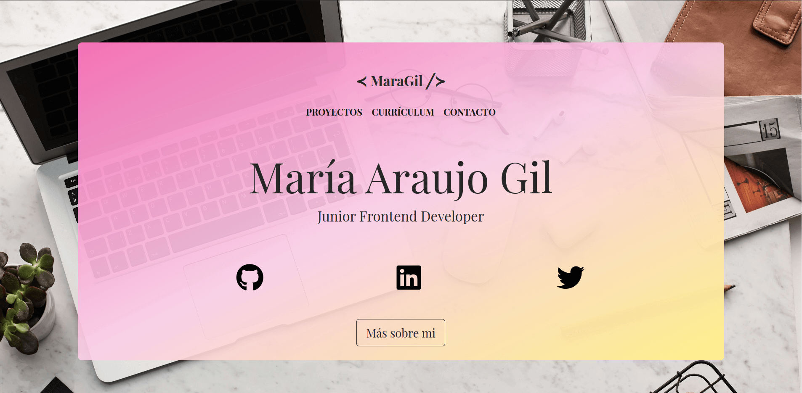

## :woman_technologist: DESARROLLADORA FRONT-END JUNIOR

🙌🏻 Hola soy María.

### 🟢 ALGUNAS COSAS SOBRE MÍ:

Hace algún tiempo decidí darle un vuelco a mi vida y aposté por el sector tecnológico, ya que siempre he sentido curiosidad por el desarrollo de aplicaciones y las experiencias que tiene el usuario con ellas. Me entusiasma superar desafíos, ya sea en mi vida personal o en mi desarrollo profesional.

### 🟣 PORFOLIO:

<a href="https://www.maragil.com" target="_blank" rel="noreferrer"> 

---

### 🔵 COMPETENCIAS TÉCNICAS:

#### FRONT-END:

 <r>     

#### BACK-END:

   

---

### 🟠 HERRAMIENTAS:

  

---

### 🔴 HABILIDADES:

- Amplia experiencia en Filosofía Agile y dominio del marco de trabajo Scrum.
- Colaboración efectiva y destrezas sobresalientes en el trabajo en equipo.
- Destrezas destacadas en la gestión eficiente del trabajo en remoto.
